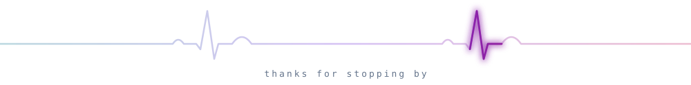

<!--
  Theme-aware profile README.
  GitHub swaps each <picture> source to match the viewer's light/dark setting,
  so every visual ships as a pair: assets/<name>-dark.svg + assets/<name>-light.svg
-->

<picture>
  <source media="(prefers-color-scheme: dark)" srcset="./assets/header-dark.svg">
  <source media="(prefers-color-scheme: light)" srcset="./assets/header-light.svg">
  
</picture>

 

<a href="https://github.com/RemuruSama">
  <picture>
    <source media="(prefers-color-scheme: dark)" srcset="./assets/badge-github-dark.svg">
    <source media="(prefers-color-scheme: light)" srcset="./assets/badge-github-light.svg">
    
  </picture>
</a>
<a href="https://t.me/CodeSenseiX">
  <picture>
    <source media="(prefers-color-scheme: dark)" srcset="./assets/badge-telegram-dark.svg">
    <source media="(prefers-color-scheme: light)" srcset="./assets/badge-telegram-light.svg">
    
  </picture>
</a>
<a href="mailto:abhinavftp98@gmail.com">
  <picture>
    <source media="(prefers-color-scheme: dark)" srcset="./assets/badge-gmail-dark.svg">
    <source media="(prefers-color-scheme: light)" srcset="./assets/badge-gmail-light.svg">
    
  </picture>
</a>

  

<picture>
  <source media="(prefers-color-scheme: dark)" srcset="./assets/section-about-dark.svg">
  <source media="(prefers-color-scheme: light)" srcset="./assets/section-about-light.svg">
  
</picture>

  Android developer focused on custom ROMs, kernels, and developer tools. Always learning, building, and experimenting with new ideas.

<picture>
  <source media="(prefers-color-scheme: dark)" srcset="./assets/flow-dark.svg">
  <source media="(prefers-color-scheme: light)" srcset="./assets/flow-light.svg">
  
</picture>

  

<picture>
  <source media="(prefers-color-scheme: dark)" srcset="./assets/section-projects-dark.svg">
  <source media="(prefers-color-scheme: light)" srcset="./assets/section-projects-light.svg">
  
</picture>

  <picture>
    <source media="(prefers-color-scheme: dark)" srcset="./assets/card-otapulse-dark.svg">
    <source media="(prefers-color-scheme: light)" srcset="./assets/card-otapulse-light.svg">
    
  </picture>
  <picture>
    <source media="(prefers-color-scheme: dark)" srcset="./assets/card-linkresolver-dark.svg">
    <source media="(prefers-color-scheme: light)" srcset="./assets/card-linkresolver-light.svg">
    
  </picture>
   
  <picture>
    <source media="(prefers-color-scheme: dark)" srcset="./assets/card-rom-dark.svg">
    <source media="(prefers-color-scheme: light)" srcset="./assets/card-rom-light.svg">
    
  </picture>
  <picture>
    <source media="(prefers-color-scheme: dark)" srcset="./assets/card-kernel-dark.svg">
    <source media="(prefers-color-scheme: light)" srcset="./assets/card-kernel-light.svg">
    
  </picture>

<picture>
  <source media="(prefers-color-scheme: dark)" srcset="./assets/footer-dark.svg">
  <source media="(prefers-color-scheme: light)" srcset="./assets/footer-light.svg">
  
</picture>

